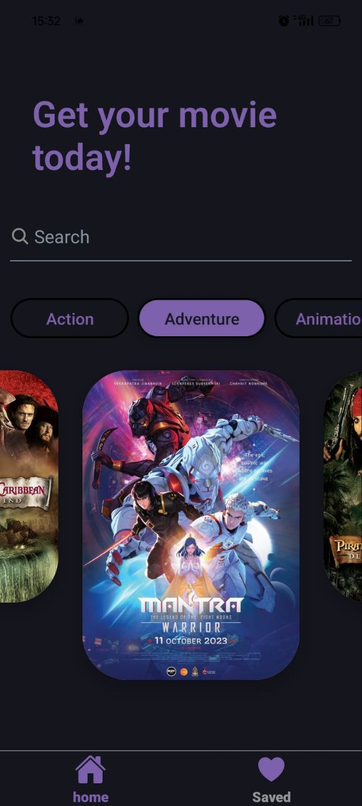
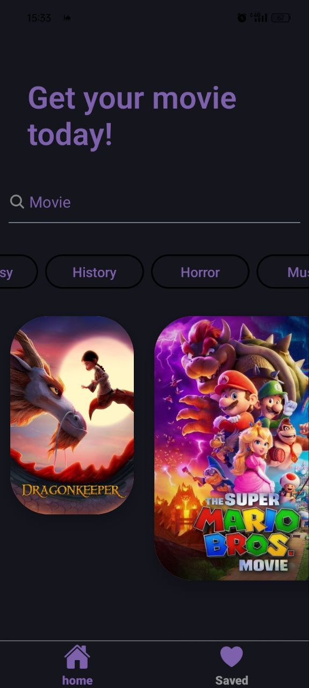
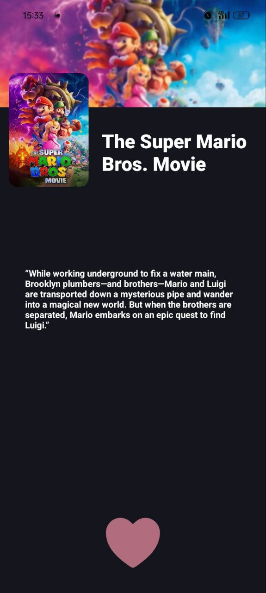
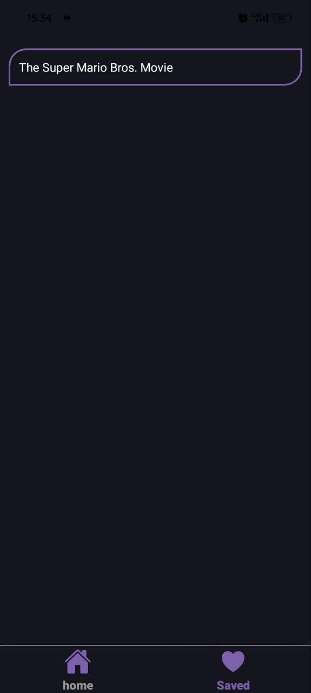
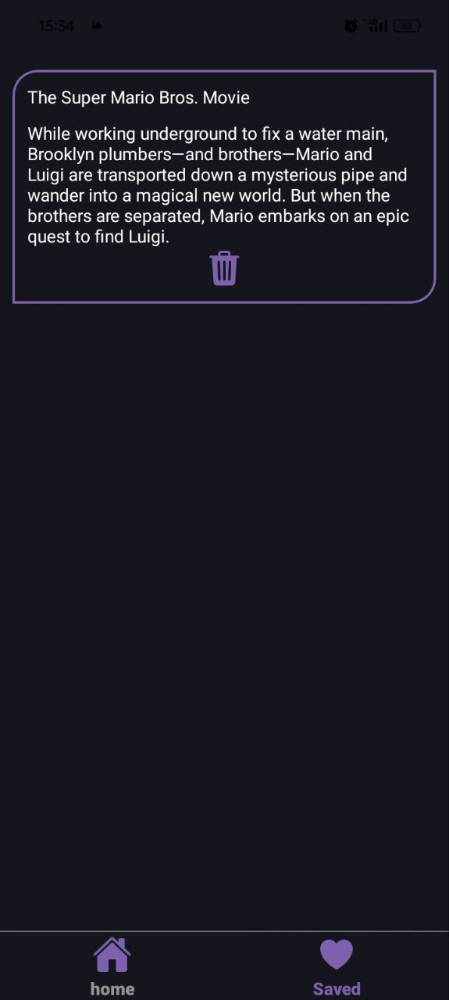

# Movie Explorer 🎬

**Movie Explorer** is a mobile application where users can search, browse, and save their favorite movies. This app provides an intuitive experience to find detailed information on any movie and save it to a separate screen for later reference, making it a handy tool for movie enthusiasts.

---

## 📱 Features

- **Search for Movies**: Find any movie by searching through our vast database.
- **Movie Details**: View comprehensive information about each movie, including its description and genre.
- **Save Movies**: Like a movie? Save it with a simple tap on the "like" button to add it to the "Saved" screen for quick access.
- **Browse Movies**: Explore a wide variety of movies and discover new favorites.

---

## 🚀 Technologies Used

This app is built using a modern tech stack, designed to ensure a smooth and engaging user experience:

- **JavaScript**
- **React Native**: For building the mobile application UI and UX.
- **Hooks**: Manage state effectively and simplify logic within functional components.
- **React Navigation**: For smooth navigation between the various screens (Home, Saved, etc.).
- **React Native Paper**: Provides a clean, consistent design with ready-to-use UI components.
- **SQLite**: Local database solution for storing and managing saved movies, supporting full CRUD operations.
- **Axios**: To handle API requests for fetching movie data efficiently.

---

## 💾 Data Storage

SQLite is used to manage saved movies, allowing for efficient data storage and retrieval on the device. You can perform CRUD (Create, Read, Update, Delete) operations seamlessly within the app, even offline.

---

## 📸 Screenshots

Below are some screenshots from the app:

  
  
  
  

  
  
  
  

---
